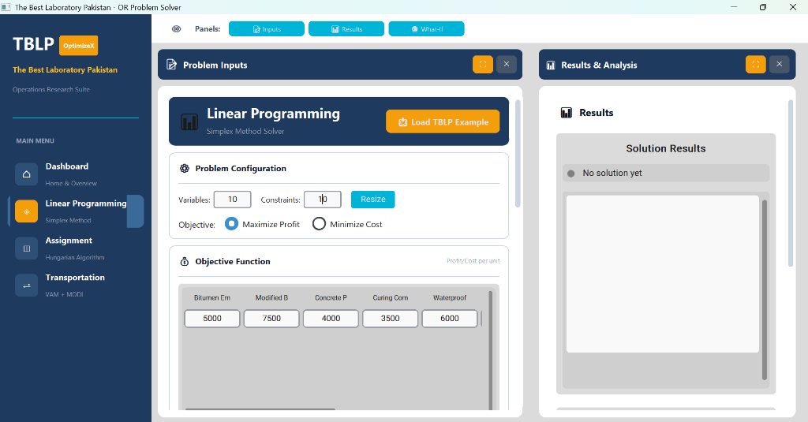
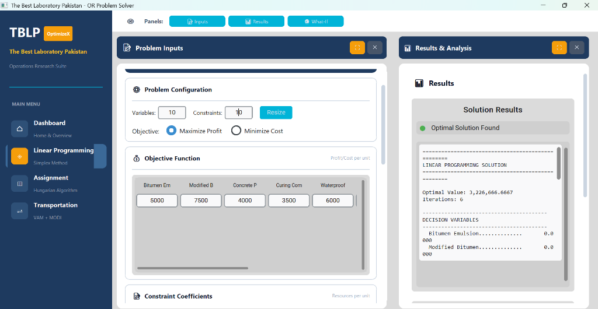
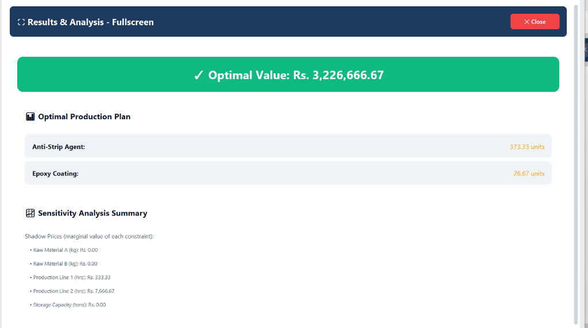
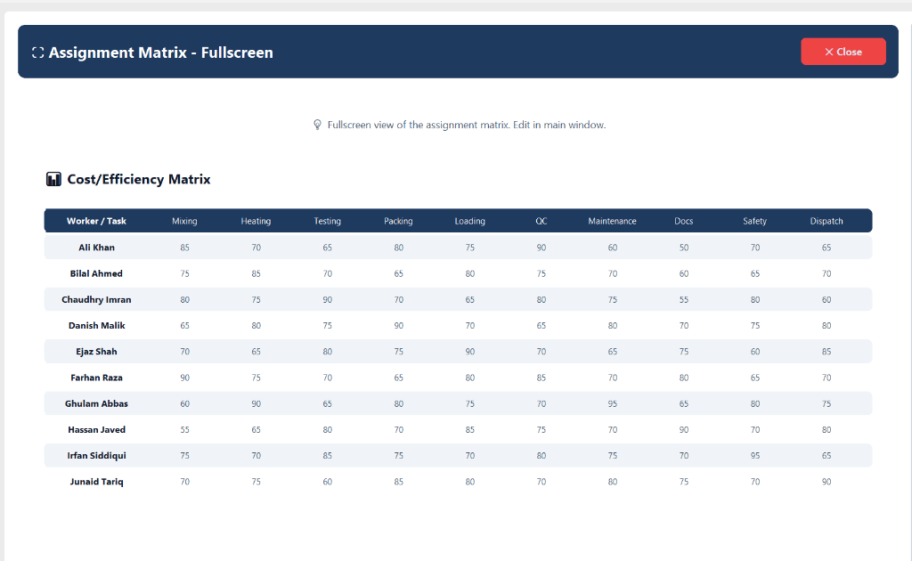
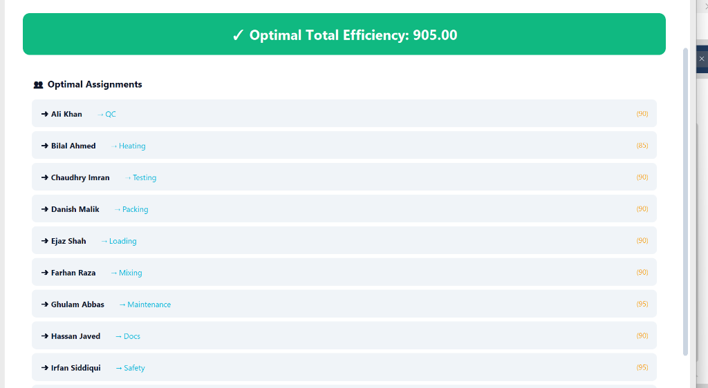
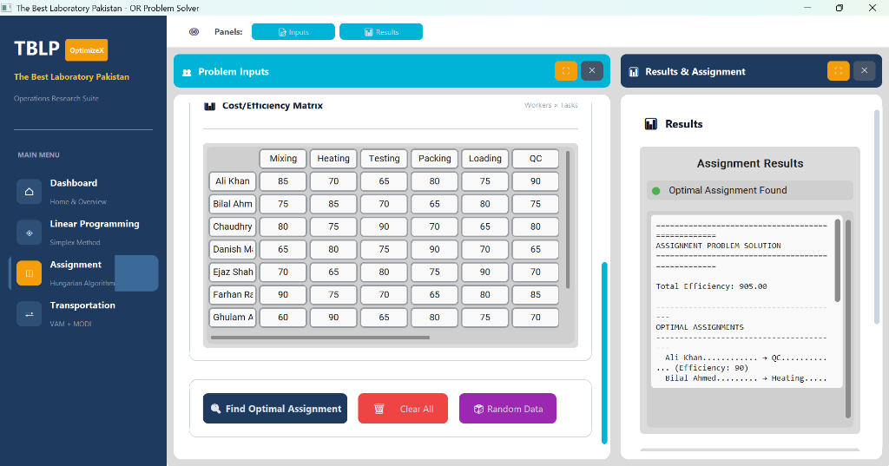
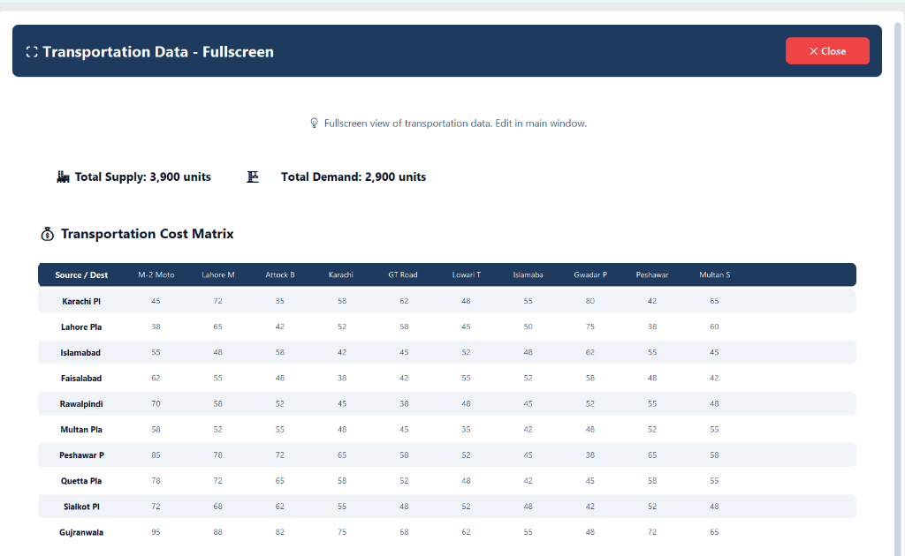
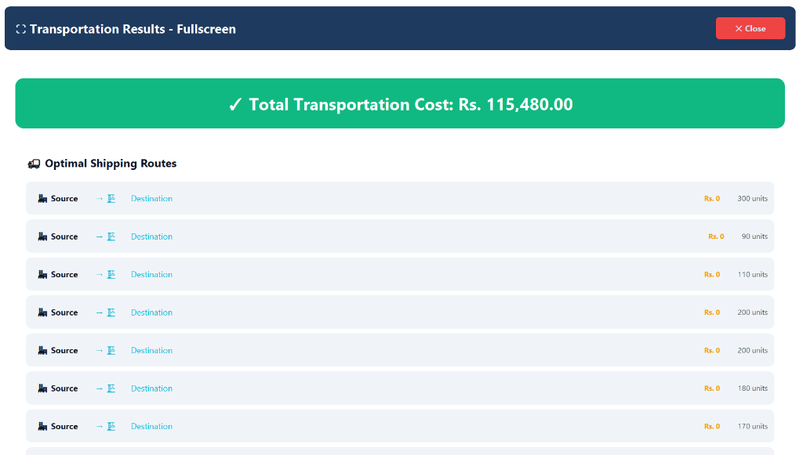

# PP Chemicals - Operations Research Problem Solver

---

## Project Report

---

### Team Members

| S.No | Roll Number | Name | Section |
|------|-------------|------|---------|
| 1 | [Roll Number] | [Name] | [Section] |
| 2 | [Roll Number] | [Name] | [Section] |
| 3 | [Roll Number] | [Name] | [Section] |
| 4 | [Roll Number] | [Name] | [Section] |

---

## 1. Problem Statement

PP Chemicals is a chemical manufacturing company that makes products for roads and buildings in Pakistan. The company faces three main problems in its daily operations:

### 1.1 Production Planning Problem
The company makes 10 different chemical products like Bitumen Emulsion, Modified Bitumen, Concrete Plasticizer, and others. Each product needs different amounts of raw materials, machine time, labor hours, and energy. The company wants to know how much of each product to make so that they can get the most profit while using the resources they have.

### 1.2 Worker Assignment Problem
The company has 10 workers and 10 different tasks like Mixing, Heating, Testing, Packing, and Quality Control. Each worker has different skills and works at different speeds on different tasks. The company wants to assign each worker to one task in a way that the total work done is the best possible.

### 1.3 Transportation Problem
The company has 10 plants in different cities of Pakistan like Karachi, Lahore, Islamabad, and others. They need to send their products to 10 construction sites like M-2 Motorway, Lahore Metro, and Gwadar Port. Each route has a different cost to ship products. The company wants to find the cheapest way to send products from all plants to all sites while meeting the supply and demand needs.

---

## 2. Objectives

The main goals of this project are:

1. **Build a desktop application** that can solve these three types of problems
2. **Help managers make better decisions** by showing them the best solutions
3. **Provide sensitivity analysis** to see how changes in data affect the solutions
4. **Create easy-to-use screens** where users can enter their data and see results
5. **Support large problems** with 10 or more variables and constraints

---

## 3. Formulation of the Problems

### 3.1 Linear Programming Problem (Simplex Method)

**Decision Variables:**
Let x₁, x₂, x₃, ..., x₁₀ be the amount (in tons) of each product to make:
- x₁ = Bitumen Emulsion
- x₂ = Modified Bitumen
- x₃ = Concrete Plasticizer
- x₄ = Curing Compound
- x₅ = Waterproofing Compound
- x₆ = Road Marking Paint
- x₇ = Anti-Strip Agent
- x₈ = Concrete Hardener
- x₉ = Epoxy Coating
- x₁₀ = Polymer Modified Bitumen

**Objective Function:**
Maximize Z = 5000x₁ + 7500x₂ + 4000x₃ + 3500x₄ + 6000x₅ + 4500x₆ + 8000x₇ + 3000x₈ + 9000x₉ + 8500x₁₀

(where the numbers are profit in Rs. per ton of each product)

**Constraints:**
The problem has 10 constraints for different resources:
1. Raw Material A: 2x₁ + 3x₂ + 1x₃ + 2x₄ + 1x₅ + 2x₆ + 3x₇ + 1x₈ + 2x₉ + 3x₁₀ ≤ 5000 kg
2. Raw Material B: 1x₁ + 2x₂ + 3x₃ + 1x₄ + 2x₅ + 1x₆ + 2x₇ + 3x₈ + 1x₉ + 2x₁₀ ≤ 4000 kg
3. Production Line 1: 3x₁ + 2x₂ + 4x₃ + 1x₄ + 2x₅ + 3x₆ + 1x₇ + 2x₈ + 4x₉ + 2x₁₀ ≤ 480 hours
4. Production Line 2: 1x₁ + 2x₂ + 1x₃ + 3x₄ + 4x₅ + 2x₆ + 1x₇ + 2x₈ + 1x₉ + 3x₁₀ ≤ 400 hours
5. Storage Capacity: 1x₁ + 1x₂ + 1x₃ + 1x₄ + 1x₅ + 1x₆ + 1x₇ + 1x₈ + 1x₉ + 1x₁₀ ≤ 1000 tons
6. Labor Hours: 4x₁ + 5x₂ + 3x₃ + 4x₄ + 5x₅ + 3x₆ + 4x₇ + 5x₈ + 3x₉ + 4x₁₀ ≤ 2000 man-hours
7. Quality Control: 0.5x₁ + 0.5x₂ + 0.5x₃ + 0.5x₄ + 0.5x₅ + 0.5x₆ + 0.5x₇ + 0.5x₈ + 0.5x₉ + 0.5x₁₀ ≤ 300 tests
8. Environmental Limit: 0.1x₁ + 0.2x₂ + 0.15x₃ + 0.1x₄ + 0.2x₅ + 0.15x₆ + 0.1x₇ + 0.2x₈ + 0.15x₉ + 0.1x₁₀ ≤ 100 units
9. Energy: 10x₁ + 15x₂ + 8x₃ + 12x₄ + 10x₅ + 8x₆ + 15x₇ + 10x₈ + 12x₉ + 14x₁₀ ≤ 10000 kWh
10. Packaging Material: 1x₁ + 2x₂ + 1x₃ + 1x₄ + 2x₅ + 1x₆ + 2x₇ + 1x₈ + 1x₉ + 2x₁₀ ≤ 2500 units

**Non-negativity:**
x₁, x₂, x₃, x₄, x₅, x₆, x₇, x₈, x₉, x₁₀ ≥ 0

**How Data was Generated:**
The profit values are based on market prices for chemical products in Pakistan. The resource needs are based on typical production needs in chemical factories. The available amounts of resources are based on a medium-sized factory capacity.

**Solution Method:**
We use the Simplex Method with the HiGHS solver from scipy library. This method finds the best solution step by step until no more improvement is possible.

---

### 3.2 Assignment Problem (Hungarian Algorithm)

**Problem Setup:**
We have a 10×10 matrix where rows are workers and columns are tasks. Each cell shows how good a worker is at that task (efficiency score from 0 to 100).

**Workers:**
1. Ali Khan
2. Bilal Ahmed
3. Chaudhry Imran
4. Danish Malik
5. Ejaz Shah
6. Farhan Raza
7. Ghulam Abbas
8. Hassan Javed
9. Irfan Siddiqui
10. Junaid Tariq

**Tasks:**
1. Mixing
2. Heating
3. Testing
4. Packing
5. Loading
6. Quality Control
7. Maintenance
8. Documentation
9. Safety Check
10. Dispatch

**Efficiency Matrix:**
```
         Mixing  Heating Testing Packing Loading  QC   Maint   Doc   Safety Dispatch
Ali        85      70      65      80      75     90    60     50      70      65
Bilal      75      85      70      65      80     75    70     60      65      70
Chaudhry   80      75      90      70      65     80    75     55      80      60
Danish     65      80      75      90      70     65    80     70      75      80
Ejaz       70      65      80      75      90     70    65     75      60      85
Farhan     90      75      70      65      80     85    70     80      65      70
Ghulam     60      90      65      80      75     70    95     65      80      75
Hassan     55      65      80      70      85     75    70     90      70      80
Irfan      75      70      85      75      70     80    75     70      95      65
Junaid     70      75      60      85      80     70    80     75      70      90
```

**Objective:**
Maximize Total Efficiency = Sum of efficiency scores of all assignments

**Constraint:**
Each worker must be assigned to exactly one task, and each task must have exactly one worker.

**How Data was Generated:**
The efficiency scores are based on typical skill levels in a factory. Higher scores mean the worker is better at that task. The scores range from 50 to 95 to show real differences in worker abilities.

**Solution Method:**
We use the Hungarian Algorithm from scipy library. This algorithm works in O(n³) time and always finds the best assignment.

---

### 3.3 Transportation Problem (VAM + MODI Method)

**Problem Setup:**
We have 10 source plants and 10 destination sites. Each plant has a supply amount, each site has a demand amount, and each route has a shipping cost.

**Sources (Plants) with Supply (tons/month):**
1. Karachi - 500
2. Lahore - 400
3. Islamabad - 350
4. Faisalabad - 450
5. Rawalpindi - 380
6. Multan - 420
7. Peshawar - 300
8. Quetta - 360
9. Sialkot - 410
10. Gujranwala - 330

**Destinations (Sites) with Demand (tons/month):**
1. M-2 Motorway - 200
2. Lahore Metro - 180
3. Attock Bridge - 300
4. Karachi Flyover - 250
5. GT Road - 350
6. Lowari Tunnel - 280
7. Islamabad Airport - 320
8. Gwadar Port - 400
9. Peshawar Railway - 290
10. Multan Stadium - 330

**Cost Matrix (Rs. per ton):**
```
              M-2   Metro  Attock Karachi  GT   Lowari  Airport Gwadar Peshawar Multan
Karachi       45     72     35      58    62     48      55      80      42      65
Lahore        38     65     42      52    58     45      50      75      38      60
Islamabad     55     48     58      42    45     52      48      62      55      45
Faisalabad    62     55     48      38    42     55      52      58      48      42
Rawalpindi    70     58     52      45    38     48      45      52      55      48
Multan        58     52     55      48    45     35      42      48      52      55
Peshawar      85     78     72      65    58     52      45      38      65      58
Quetta        78     72     65      58    52     48      42      45      58      55
Sialkot       72     68     62      55    48     52      48      42      52      48
Gujranwala    95     88     82      75    68     62      55      48      72      65
```

**Objective:**
Minimize Total Transportation Cost = Sum of (quantity shipped × cost per ton) for all routes

**Constraints:**
1. Total shipped from each source = Supply at that source
2. Total received at each destination = Demand at that destination

**How Data was Generated:**
The supply and demand values are based on typical factory capacities and construction project needs. The shipping costs are based on distances between cities in Pakistan and typical trucking rates.

**Solution Method:**
1. **Initial Solution:** We use Vogel's Approximation Method (VAM) to find a starting solution. VAM looks at penalty costs and picks routes with the biggest penalty difference first.

2. **Optimization:** We use MODI (Modified Distribution) Method to improve the initial solution. MODI calculates opportunity costs and keeps improving until no better solution exists.

---

## 4. Results

### 4.1 Linear Programming Results

**Dashboard Screen:**
The main screen shows three cards for the three problem types. Users can click on any card to open that solver.

**Simplex Input Screen:**
Users can enter:
- Number of variables (products) and constraints (resources)
- Objective function coefficients (profit per product)
- Constraint matrix (resources needed per product)
- Right-hand side values (available resources)
- Choose maximize or minimize

**Solution Display:**
After clicking "Solve Problem", the system shows:
- Status: Optimal solution found
- Optimal Profit: The maximum profit value
- Production Plan: How much of each product to make
- Iterations: How many steps the solver took

**Sensitivity Analysis:**
The system shows:
- **Shadow Prices:** How much profit increases if we get one more unit of each resource
- **Reduced Costs:** How much a product's profit must increase before we should make it
- **Slack Values:** How much of each resource is left unused
- **Allowable Ranges:** How much parameters can change without changing the basic solution

**Sensitivity Interpretation:**
- If a shadow price is Rs. 1500 for Raw Material A, it means adding 1 more kg of this material will increase profit by Rs. 1500
- If a slack value is 0, that resource is fully used (binding constraint)
- If allowable increase is infinity, we can add any amount without changing the solution structure

---

### 4.2 Assignment Problem Results

**Input Screen:**
Users can enter:
- Size of the assignment matrix (10×10 in our case)
- Efficiency or cost values for each worker-task pair
- Choose maximize (efficiency) or minimize (cost)

**Solution Display:**
The system shows:
- Total Efficiency Score: Sum of efficiency values for all assignments
- Assignment List: Which worker is assigned to which task
- Assignment Matrix: Visual grid showing assignments marked with brackets

**Sample Output:**
```
Optimal Assignments:
  Ali Khan → Quality Control (Efficiency: 90)
  Bilal Ahmed → Heating (Efficiency: 85)
  Chaudhry Imran → Testing (Efficiency: 90)
  Danish Malik → Packing (Efficiency: 90)
  Ejaz Shah → Loading (Efficiency: 90)
  Farhan Raza → Mixing (Efficiency: 90)
  Ghulam Abbas → Maintenance (Efficiency: 95)
  Hassan Javed → Documentation (Efficiency: 90)
  Irfan Siddiqui → Safety Check (Efficiency: 95)
  Junaid Tariq → Dispatch (Efficiency: 90)

Total Efficiency Score: 905
```

---

### 4.3 Transportation Problem Results

**Input Screen:**
Users can enter:
- Number of sources and destinations
- Supply at each source
- Demand at each destination
- Transportation cost matrix
- Initial solution method (VAM, Least Cost, or North-West Corner)

**Solution Display:**
The system shows:
- Total Transportation Cost: Minimum cost to ship all products
- Initial Method Used: Which method was used for starting solution
- MODI Iterations: How many improvement steps were needed
- Route Details: From which plant to which site, how much, and at what cost

**Allocation Matrix:**
Shows the shipping plan with quantities in brackets:
```
              M-2   Metro  Attock Karachi  GT   Lowari  Airport Gwadar Peshawar Multan | Supply
Karachi      [200]    -    [300]    -      -      -       -       -       -       -    |   500
Lahore         -   [180]    -       -     [220]    -       -       -       -       -    |   400
...
Demand        200    180    300    250    350    280     320     400     290     330
```

**Sensitivity Issues:**
- If a route has zero allocation but positive opportunity cost, using it would increase total cost
- If demand at a site changes, the optimal routes may change
- Adding new routes with lower costs can reduce total cost

---

### 4.4 Application Screenshots

#### 4.4.1 Linear Programming - Problem Input



**What this shows:**
- Problem Inputs panel for Linear Programming
- Users can set number of variables and constraints
- Objective function with profit/cost for each product
- Products: Bitumen Emulsion, Modified Bitumen, Concrete Primer, etc.
- Option to Maximize Profit or Minimize Cost

#### 4.4.2 Linear Programming - Solution Output



**What this shows:**
- Results & Analysis panel with solved solution
- Optimal Value: Rs. 3,226,666.67
- Number of iterations: 6
- Decision variables showing how much to produce
- Each product's recommended quantity

#### 4.4.3 Linear Programming - Fullscreen Results



**What this shows:**
- Fullscreen view of complete results
- Optimal Production Plan:
  - Anti-Strip Agent: 373.33 units
  - Epoxy Coating: 26.67 units
- Sensitivity Analysis with shadow prices:
  - Raw Material A: Rs. 0.00
  - Raw Material B: Rs. 0.00
  - Production Line 1: Rs. 333.33
  - Production Line 2: Rs. 7,666.67
  - Storage Capacity: Rs. 0.00

#### 4.4.4 Assignment Problem - Cost/Efficiency Matrix



**What this shows:**
- 10x10 Cost/Efficiency Matrix in fullscreen
- Rows = Workers (Ali Khan, Bilal Ahmed, etc.)
- Columns = Tasks (Mixing, Heating, Testing, etc.)
- Each cell = efficiency score (0 to 100)
- Higher score means worker is better at that task

#### 4.4.5 Assignment Problem - Optimal Assignments



**What this shows:**
- Optimal Total Efficiency: 905.00
- Each worker assigned to their best task:
  - Ali Khan → QC (90)
  - Bilal Ahmed → Heating (85)
  - Chaudhry Imran → Testing (90)
  - Danish Malik → Packing (90)
  - Ejaz Shah → Loading (90)
  - Farhan Raza → Mixing (90)
  - Ghulam Abbas → Maintenance (95)
  - Hassan Javed → Docs (90)
  - Irfan Siddiqui → Safety (95)

#### 4.4.6 Assignment Problem - Full Interface



**What this shows:**
- Left panel: Problem Inputs with Cost/Efficiency Matrix
- Right panel: Results showing optimal assignments
- Buttons: Find Optimal Assignment, Clear All, Random Data
- Status: Optimal Assignment Found

#### 4.4.7 Transportation Problem - Cost Matrix



**What this shows:**
- 10x10 Transportation Cost Matrix
- Sources (Plants): Karachi, Lahore, Islamabad, Faisalabad, etc.
- Destinations (Sites): M-2 Motorway, Lahore Metro, GT Road, etc.
- Total Supply: 3,900 units
- Total Demand: 2,900 units
- Problem is unbalanced (supply > demand)

#### 4.4.8 Transportation Problem - Optimal Routes



**What this shows:**
- Total Transportation Cost: Rs. 115,480.00
- Optimal Shipping Routes list:
  - Shows source plant, destination site
  - Cost per unit and quantity shipped
- Solution uses VAM + MODI method
- Minimizes total shipping cost


## 5. Codes

### 5.1 Simplex Solver Code (simplex.py)

```python
import numpy as np
from scipy.optimize import linprog
from dataclasses import dataclass
from typing import Optional, List, Tuple, Dict, Any

@dataclass
class SensitivityAnalysis:
    shadow_prices: np.ndarray
    reduced_costs: np.ndarray
    slack_values: np.ndarray
    constraint_rhs_ranges: List[Dict]
    objective_coeff_ranges: List[Dict]

@dataclass
class SimplexResult:
    success: bool
    message: str
    optimal_value: float
    solution: np.ndarray
    sensitivity: Optional[SensitivityAnalysis]
    iterations: int
    status: int

class SimplexSolver:
    def __init__(
        self,
        c: np.ndarray,
        A_ub: Optional[np.ndarray] = None,
        b_ub: Optional[np.ndarray] = None,
        A_eq: Optional[np.ndarray] = None,
        b_eq: Optional[np.ndarray] = None,
        bounds: Optional[List[Tuple[float, float]]] = None,
        maximize: bool = True,
        variable_names: Optional[List[str]] = None,
        constraint_names: Optional[List[str]] = None
    ):
        self.c = np.array(c, dtype=float)
        self.A_ub = np.array(A_ub, dtype=float) if A_ub is not None else None
        self.b_ub = np.array(b_ub, dtype=float) if b_ub is not None else None
        self.A_eq = np.array(A_eq, dtype=float) if A_eq is not None else None
        self.b_eq = np.array(b_eq, dtype=float) if b_eq is not None else None
        self.bounds = bounds if bounds else [(0, None) for _ in range(len(c))]
        self.maximize = maximize
        self.variable_names = variable_names or [f"x{i+1}" for i in range(len(c))]
        self.constraint_names = constraint_names or []
        self._result = None
        self._sensitivity = None

    def solve(self) -> SimplexResult:
        c_solve = -self.c if self.maximize else self.c
        try:
            result = linprog(
                c_solve,
                A_ub=self.A_ub,
                b_ub=self.b_ub,
                A_eq=self.A_eq,
                b_eq=self.b_eq,
                bounds=self.bounds,
                method='highs'
            )
            if result.success:
                optimal_value = -result.fun if self.maximize else result.fun
                sensitivity = self._compute_sensitivity_analysis(result)
                self._result = SimplexResult(
                    success=True,
                    message="Optimal solution found",
                    optimal_value=optimal_value,
                    solution=result.x,
                    sensitivity=sensitivity,
                    iterations=result.nit if hasattr(result, 'nit') else 0,
                    status=result.status
                )
            else:
                self._result = SimplexResult(
                    success=False,
                    message=result.message,
                    optimal_value=0.0,
                    solution=np.zeros(len(self.c)),
                    sensitivity=None,
                    iterations=result.nit if hasattr(result, 'nit') else 0,
                    status=result.status
                )
        except Exception as e:
            self._result = SimplexResult(
                success=False,
                message=str(e),
                optimal_value=0.0,
                solution=np.zeros(len(self.c)),
                sensitivity=None,
                iterations=0,
                status=-1
            )
        return self._result

    def _compute_sensitivity_analysis(self, result) -> SensitivityAnalysis:
        n_vars = len(self.c)
        n_ub = len(self.b_ub) if self.b_ub is not None else 0
        n_eq = len(self.b_eq) if self.b_eq is not None else 0
        shadow_prices = np.zeros(n_ub + n_eq)
        if hasattr(result, 'ineqlin') and result.ineqlin is not None:
            marginals = getattr(result.ineqlin, 'marginals', None)
            if marginals is not None:
                shadow_prices[:n_ub] = marginals if not self.maximize else -marginals
        reduced_costs = np.zeros(n_vars)
        if hasattr(result, 'lower') and result.lower is not None:
            marginals = getattr(result.lower, 'marginals', None)
            if marginals is not None:
                reduced_costs = marginals if not self.maximize else -marginals
        slack_values = np.zeros(n_ub)
        if self.A_ub is not None and self.b_ub is not None:
            slack_values = self.b_ub - np.dot(self.A_ub, result.x)
        constraint_rhs_ranges = self._compute_rhs_ranges(result, shadow_prices)
        objective_coeff_ranges = self._compute_objective_ranges(result, reduced_costs)
        return SensitivityAnalysis(
            shadow_prices=shadow_prices,
            reduced_costs=reduced_costs,
            slack_values=slack_values,
            constraint_rhs_ranges=constraint_rhs_ranges,
            objective_coeff_ranges=objective_coeff_ranges
        )
```

---

### 5.2 Assignment Solver Code (assignment.py)

```python
import numpy as np
from scipy.optimize import linear_sum_assignment
from dataclasses import dataclass
from typing import List, Tuple, Optional, Dict, Any

@dataclass
class AssignmentResult:
    success: bool
    message: str
    total_cost: float
    assignments: List[Tuple[int, int]]
    assignment_matrix: np.ndarray
    individual_costs: List[float]

class AssignmentSolver:
    def __init__(
        self,
        cost_matrix: np.ndarray,
        maximize: bool = False,
        row_names: Optional[List[str]] = None,
        col_names: Optional[List[str]] = None
    ):
        self.cost_matrix = np.array(cost_matrix, dtype=float)
        self.maximize = maximize
        self.n_rows, self.n_cols = self.cost_matrix.shape
        self.row_names = row_names or [f"Worker {i+1}" for i in range(self.n_rows)]
        self.col_names = col_names or [f"Task {i+1}" for i in range(self.n_cols)]
        self._result = None

    def solve(self) -> AssignmentResult:
        try:
            if self.maximize:
                solve_matrix = -self.cost_matrix
            else:
                solve_matrix = self.cost_matrix
            if self.n_rows != self.n_cols:
                max_dim = max(self.n_rows, self.n_cols)
                padded_matrix = np.zeros((max_dim, max_dim))
                if not self.maximize:
                    padded_matrix.fill(np.max(solve_matrix) * 1000)
                padded_matrix[:self.n_rows, :self.n_cols] = solve_matrix
                solve_matrix = padded_matrix
            row_ind, col_ind = linear_sum_assignment(solve_matrix)
            valid_assignments = [
                (r, c) for r, c in zip(row_ind, col_ind)
                if r < self.n_rows and c < self.n_cols
            ]
            individual_costs = [
                self.cost_matrix[r, c] for r, c in valid_assignments
            ]
            total_cost = sum(individual_costs)
            assignment_matrix = np.zeros_like(self.cost_matrix, dtype=int)
            for r, c in valid_assignments:
                assignment_matrix[r, c] = 1
            self._result = AssignmentResult(
                success=True,
                message="Optimal assignment found",
                total_cost=total_cost,
                assignments=valid_assignments,
                assignment_matrix=assignment_matrix,
                individual_costs=individual_costs
            )
        except Exception as e:
            self._result = AssignmentResult(
                success=False,
                message=str(e),
                total_cost=0.0,
                assignments=[],
                assignment_matrix=np.zeros_like(self.cost_matrix, dtype=int),
                individual_costs=[]
            )
        return self._result
```

---

### 5.3 Transportation Solver Code (transportation.py)

```python
import numpy as np
from dataclasses import dataclass
from typing import List, Tuple, Optional, Dict, Any
from enum import Enum

class InitialMethod(Enum):
    NORTH_WEST_CORNER = "north_west"
    LEAST_COST = "least_cost"
    VOGEL = "vam"

@dataclass
class TransportationResult:
    success: bool
    message: str
    total_cost: float
    allocation_matrix: np.ndarray
    route_details: List[Dict]
    is_optimal: bool
    iterations: int
    initial_method: str

class TransportationSolver:
    def __init__(
        self,
        supply: np.ndarray,
        demand: np.ndarray,
        cost_matrix: np.ndarray,
        source_names: Optional[List[str]] = None,
        dest_names: Optional[List[str]] = None
    ):
        self.supply = np.array(supply, dtype=float)
        self.demand = np.array(demand, dtype=float)
        self.cost_matrix = np.array(cost_matrix, dtype=float)
        self.m = len(supply)
        self.n = len(demand)
        self.source_names = source_names or [f"Source {i+1}" for i in range(self.m)]
        self.dest_names = dest_names or [f"Dest {j+1}" for j in range(self.n)]
        self._balance_problem()
        self._result = None

    def _balance_problem(self):
        total_supply = np.sum(self.supply)
        total_demand = np.sum(self.demand)
        if abs(total_supply - total_demand) > 1e-6:
            if total_supply > total_demand:
                diff = total_supply - total_demand
                self.demand = np.append(self.demand, diff)
                dummy_col = np.zeros((self.m, 1))
                self.cost_matrix = np.hstack([self.cost_matrix, dummy_col])
                self.dest_names.append("Dummy Destination")
                self.n += 1
            else:
                diff = total_demand - total_supply
                self.supply = np.append(self.supply, diff)
                dummy_row = np.zeros((1, self.n))
                self.cost_matrix = np.vstack([self.cost_matrix, dummy_row])
                self.source_names.append("Dummy Source")
                self.m += 1

    def _vogel_approximation_method(self) -> np.ndarray:
        allocation = np.zeros((self.m, self.n))
        supply_left = self.supply.copy()
        demand_left = self.demand.copy()
        active_rows = [True] * self.m
        active_cols = [True] * self.n
        while np.sum(supply_left) > 1e-6 and np.sum(demand_left) > 1e-6:
            row_penalties = []
            for i in range(self.m):
                if not active_rows[i]:
                    row_penalties.append(-1)
                    continue
                costs = [self.cost_matrix[i, j] for j in range(self.n)
                        if active_cols[j] and demand_left[j] > 0]
                if len(costs) >= 2:
                    costs.sort()
                    row_penalties.append(costs[1] - costs[0])
                elif len(costs) == 1:
                    row_penalties.append(costs[0])
                else:
                    row_penalties.append(-1)
            col_penalties = []
            for j in range(self.n):
                if not active_cols[j]:
                    col_penalties.append(-1)
                    continue
                costs = [self.cost_matrix[i, j] for i in range(self.m)
                        if active_rows[i] and supply_left[i] > 0]
                if len(costs) >= 2:
                    costs.sort()
                    col_penalties.append(costs[1] - costs[0])
                elif len(costs) == 1:
                    col_penalties.append(costs[0])
                else:
                    col_penalties.append(-1)
            max_row_penalty = max(row_penalties) if row_penalties else -1
            max_col_penalty = max(col_penalties) if col_penalties else -1
            if max_row_penalty >= max_col_penalty and max_row_penalty >= 0:
                i = row_penalties.index(max_row_penalty)
                min_cost = np.inf
                min_j = 0
                for j in range(self.n):
                    if active_cols[j] and demand_left[j] > 0:
                        if self.cost_matrix[i, j] < min_cost:
                            min_cost = self.cost_matrix[i, j]
                            min_j = j
                j = min_j
            elif max_col_penalty >= 0:
                j = col_penalties.index(max_col_penalty)
                min_cost = np.inf
                min_i = 0
                for i in range(self.m):
                    if active_rows[i] and supply_left[i] > 0:
                        if self.cost_matrix[i, j] < min_cost:
                            min_cost = self.cost_matrix[i, j]
                            min_i = i
                i = min_i
            else:
                break
            quantity = min(supply_left[i], demand_left[j])
            allocation[i, j] = quantity
            supply_left[i] -= quantity
            demand_left[j] -= quantity
            if supply_left[i] <= 1e-6:
                active_rows[i] = False
            if demand_left[j] <= 1e-6:
                active_cols[j] = False
        return allocation

    def solve(self, method: InitialMethod = InitialMethod.VOGEL, optimize: bool = True) -> TransportationResult:
        try:
            if method == InitialMethod.VOGEL:
                allocation = self._vogel_approximation_method()
            iterations = 0
            is_optimal = False
            if optimize:
                allocation, iterations = self._optimize_modi(allocation)
                is_optimal = True
            total_cost = np.sum(allocation * self.cost_matrix)
            route_details = []
            for i in range(self.m):
                for j in range(self.n):
                    if allocation[i, j] > 1e-6:
                        route_details.append({
                            'from': self.source_names[i],
                            'to': self.dest_names[j],
                            'quantity': allocation[i, j],
                            'unit_cost': self.cost_matrix[i, j],
                            'route_cost': allocation[i, j] * self.cost_matrix[i, j]
                        })
            self._result = TransportationResult(
                success=True,
                message="Optimal solution found" if is_optimal else "Initial solution found",
                total_cost=total_cost,
                allocation_matrix=allocation,
                route_details=route_details,
                is_optimal=is_optimal,
                iterations=iterations,
                initial_method=method.value
            )
        except Exception as e:
            self._result = TransportationResult(
                success=False,
                message=str(e),
                total_cost=0.0,
                allocation_matrix=np.zeros((self.m, self.n)),
                route_details=[],
                is_optimal=False,
                iterations=0,
                initial_method=method.value
            )
        return self._result
```

---

### 5.4 Main Application Entry Point (main.py)

```python
import sys
import os

sys.path.insert(0, os.path.dirname(os.path.abspath(__file__)))

from ui.app import App

def main():
    print("=" * 50)
    print("PP CHEMICALS - OR Problem Solver")
    print("=" * 50)
    print("\nStarting application...")
    try:
        app = App()
        app.mainloop()
    except Exception as e:
        print(f"\nError: {e}")
        print("\nPlease ensure all dependencies are installed:")
        print("  pip install customtkinter numpy scipy pandas openpyxl")
        sys.exit(1)

if __name__ == "__main__":
    main()
```

---

## 6. Conclusion

In this project, we built a desktop application to solve three important Operations Research problems for PP Chemicals company. The application uses well-known algorithms to find the best solutions:

1. **Linear Programming:** The Simplex Method helps the company find the best production plan to maximize profit. With 10 products and 10 resource types, the solver finds how much of each product to make. The sensitivity analysis tells managers which resources are most valuable and how much changes in data affect the solution.

2. **Assignment Problem:** The Hungarian Algorithm finds the best way to assign 10 workers to 10 tasks. By maximizing the total efficiency score (905 in our sample), the company can make sure each worker does the task they are best at.

3. **Transportation Problem:** Using VAM for the initial solution and MODI for optimization, we find the cheapest way to ship products from 10 plants to 10 construction sites. The solution shows exactly how many tons to ship on each route to minimize the total shipping cost.

The application has an easy-to-use interface built with CustomTkinter. Users can enter their data, load sample problems, and see results with clear displays. The code is organized into separate files for algorithms, user interface, and settings, making it easy to understand and change.

This tool can help PP Chemicals managers make better decisions about production, worker assignment, and shipping. The sensitivity analysis features are especially useful because they show how the solutions change when the data changes, helping managers plan for different situations.

---

*********************END********************
